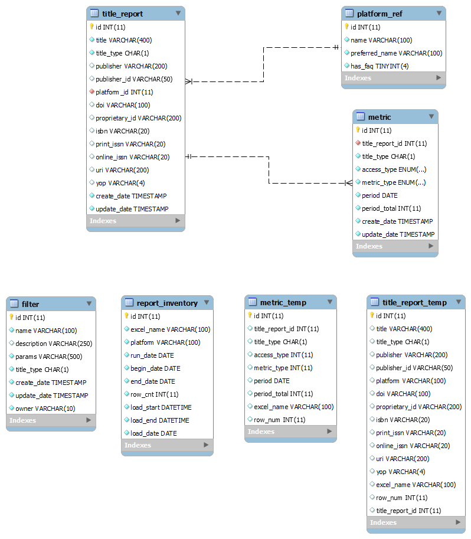
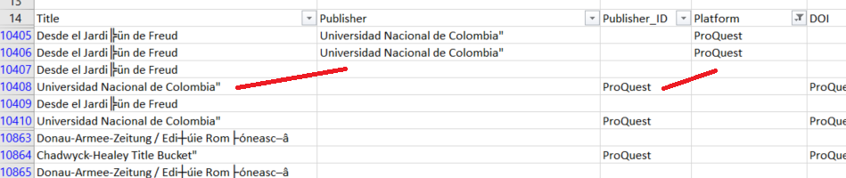

# COUNTER

**COUNTER** stands for Counting Online Usage of NeTworked Electronic Resources. It
is both a standard and the name of the governing body responsible for publishing
the related code of practice (CoP). The governing body represents a collaborative
effort of publishers and librarians whose collective goal is to develop and
maintain the standard (CoP) for counting the use of electronic resources in
library environments.

This document refers to the online tool developed by Libraries IT that simplifies
the aggregation and reporting of electronic resource usage data for University
Libraries.

## Overview of Loading Process
The following describes the steps to load COUNTER data from Excel spreadsheets. These
spreadsheets, or reports, are downloaded from the various platform sites by e-resources
staff and are stored on the Q: drive (typically Q:\SharedDocs\Usage Stats) in year-specific
folders. The product development team is notified by email that new reports are available
for processing and importing into the COUNTER database.

Workflow steps:

1. Copy new reports to remote server.
2. Run preprocessing/renaming script.
3. Replicate production database on staging.
4. Run loading script.
5. Restore production database from staging.
6. Archive reports to AWS S3.

Each of these steps will be described in further detail later.

## Staging Infrastructure
The COUNTER staging infrastructure consists of an EC2 instance (counter-staging) with MySQL 5.7
installed. This approach removes the loading workload to AWS from your local desktop/laptop.
The staging server also facilitates access to both the test and production databases in RDS.
Details of the instance can be found in the AWS console.

Loading scripts and associated modules can be copied to the staging server by cloning the Github
repo (assuming you are starting at the home directory):

    $ git clone https://github.com/culibraries/counter-data-loader.git

After cloning the repo, you will need to copy the `config.py` file to the /counter-data-loader/dataloader
directory to enable a connection to the local MySQL database. The config file is available in KeePass
in the MySQL folder.

All data (including the MySQL database) is stored on an attached volume (/dev/sdf) currently
sized at 50 GiB.

In addition to MySQL, the staging server requires the following software components:

* Python 3.x
* openpyxl 3.0.9
* mysql-connector-python 8.0.27
* boto3 1.19.7
* botocore 1.22.7

Versions are minimum requirements. Updated modules are acceptable.

## Database Schema

## Details of the Loading Process
### Copy New Reports to Remote Server
Copy all files to be processed from the Q: drive to the remote server. The working directory
for all source files is /data/counter.

### Run Preprocessing/Renaming Script
Run the following command:

    $ python3 preprocess-source-files.py <report directory>

This script will rename all files in the specified working directory to a common format.
Refer to the comments in the code for a description of the naming convention.

If errors are raised, they will be recorded in an error log.

### Replicate Production Database on Staging
The starting point for loading new COUNTER reports is the current production database. To
replicate the production database on staging, run the following commands:

    $ mysqldump --databases counter5 -h cudbcluster.cluster-cn8ntk7wk5rt.us-west-2.rds.amazonaws.com -u dbmuser -p --add-drop-database -r /data/backups/20220329-counter-prod.sql
    $ mysql -u dbmuser -p < /data/backups/20220329-counter-prod.sql

When prompted, enter the password for dbmuser (available in KeePass). Be patient as the dump and load can
take a bit of time depending on the size of the production database. While the dump is fairly quick (~30-45s),
the load can take upwards of 8-10 minutes.

NOTE: Use the current date-time stamp as the file prefix.

To improve loading performance, drop all indexes:

    $ mysql counter5 -u dbmuser -p < sql/drop-indexes.sql

At this point, the staging database is ready for loading the new files.

### Run Loading Script
The loading process is a multistep process:

* Read the title and usage data in the source Excel spreadsheet.
* Generate CSV files from the spreadsheet representing title information and corresponding metrics.
* Import CSV files into temporary tables.
* Do inserts/updates in title and metric tables.
* Log the spreadsheet as processed.

This is an iterative process that is performed for every spreadsheet to the loaded.

The entire sequence of steps as outlined above are initiated and executed from a single "controller"
file (loader.py). The process is started by entering the following command:

    $ python3 loader.py <report directory> <year>

The report directory parameter is the location of the prepared Excel files. The year parameter is
the 4-digit year that corresponds to the usage data, e.g., for a report containing usage data for
2021, this parameter value would be "2021" (without the quotes).

Refer to the source code comments for further details.

### Restore Database to Test/Production
Once all spreadsheets have been loaded, the database on the staging server can be restored to
the test RDS cluster for acceptance testing:

    $ mysqldump --databases counter5 -u dbmuser -p --add-drop-database -r /data/backups/20220329-counter-staging.sql
    $ mysql -h test-dbcluster.cluster-cn8ntk7wk5rt.us-west-2.rds.amazonaws.com -u dbmuser -p < /data/backups/20220329-counter-staging.sql

Next recreate the indexes in the test environment:

    $ mysql counter5 -h test-dbcluster.cluster-cn8ntk7wk5rt.us-west-2.rds.amazonaws.com -u dbmuser -p < sql/create-indexes.sql

With the test database restored, the designated product team can begin acceptance testing. For this step,
it is recommended that a handful of spreadsheets be compared to the data returned from the UI. On
completion of testing, the updated database can be restored to the production environment:

    $ mysql -h cudbcluster.cluster-cn8ntk7wk5rt.us-west-2.rds.amazonaws.com -u dbmuser -p < /data/backups/20220329-counter-staging.sql
    $ mysql -h cudbcluster.cluster-cn8ntk7wk5rt.us-west-2.rds.amazonaws.com -u dbmuser -p < sql/create-indexes.sql

### Archive Reports to AWS S3
The last step in the process is to archive all of the processed spreadsheets by moving them to AWS S3.
Do this by running the following command:

    $ aws s3 mv /data/counter/ s3://cubl-backup/counter-reports/ --recursive --storage-class ONEZONE_IA

## Other Considerations
### Running Loading Script in Screen Mode
It is recommended that the loading script be run in a Linux `screen` session. Using this approach
will enable the script to run in the background while disconnected from the remote host.

To start a screen session, just type `screen` at the command prompt. This will open a new
screen session. From this point forward, enter commands as you normally would. To return to the
default terminal window, enter `ctrl+a d` to detach from the screen session. The program running
in the screen session will continue to run after you detach from the session.

To resume the screen session, enter `screen -r` at the command prompt.

Further information about the Linux screen command is available at
[How To Use Linux Screen](https://linuxize.com/post/how-to-use-linux-screen/).

### When Errors Occur During Loading
The loading process will raise an error (and log it) if the source spreadsheet cannot be loaded. Errors
typically occur when the spreadsheet does not adhere to the COUNTER specification. For example, sometimes
there will be a blank row at the top of the spreadsheet. Other formatting issues may also cause errors
and two common problems are:

* A platform name is not referenced in the `platform_ref` table.
* ProQuest data consistently presents problems that preclude a clean load.

For the platform name issue, either add the missing platform data to the `platform_ref` table or update
the spreadsheet (the platform column) to reflect a known reference value. Save the changes and
reload the spreadsheet.

For the Proquest issue, same title entries spill over into two rows (see example below), a situation
that will cause the load process to fail. In these cases (it's usually 12 or so rows), the simplest
approach (though tedious) is to manually fix the offending rows, save the changes, and then reload
the spreadsheet.

In these cases, the loading script will skip the spreadsheet and move on to the next one in the queue.
An entry will also be written to a log file. After loading has finished, these Excel files should be
examined for any obvious formatting errors and, if found, these can be rectified and the loading
script rerun. If errors persist, let the Product Owner know.

### Updating the platform_ref Table
If a new platform needs to be added to the `platform_ref` table, enter the following command in
the MySQL environment:

    mysql> INSERT INTO platform_ref VALUES (id, name, preferred_name, has_faq);

where

* id = the next id in the sequence (do a select max(id) to find the max)
* name = the name contained in the spreadsheet that needs to be reference
* preferred_name = the common or preferred name for the platform (consult with the PO as needed)
* has_faq = is always 0 (reserved for future use)

### Using a Virtual Environment
TBD
