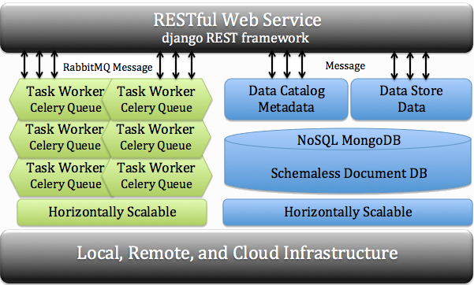

# Cybercom API

Cybercomm API is based from [open-source project](https://cybercom-docs.readthedocs.io/en/latest/). CU Boulder library modified the API using federated SSO and security group merge for both local groups and grouper groups.



## Containers

1. API django application [dockerfile](https://github.com/culibraries/cybercom-k8s-api/blob/main/dockerfile)
1. Celery [dockerfile](https://github.com/culibraries/cybercom-k8s-api/blob/main/dc_config/images/celery/dockerfile)
1. Docker Hub: RabbitMQ - rabbitmq:3.6
1. Docker Hub: Mongo - mongo:4.2.10
1. Docker Hub: Memcache - memcached:latest

## Configuration

Refer to [cybercommons](https://cybercom-docs.readthedocs.io/en/latest/pages/configuration.html#configuration-files)  for system configuration documentation. This documentation assumes you are not working in kubernetes. 

Changes with Kubernetes:
1. Secret(cybercom) contains all secrets
1. Encrypted communication through self signed certificates stored in Secret(cybercom)
1. Within container certs are mounted from secret and located `/ssl` directory.
1. Certificates are valid
    ```sh
    cat /ssl/server/mongodb.pem | openssl x509 -noout -enddate
    notAfter=Sep 10 19:12:02 2029 GMT
    ```
1. Federated SSO certificates are stored in Secret(cybercom)
1. [SAML Service Provider](https://github.com/culibraries/django-saml2-pro-auth/blob/master/README.md)

## Catalog and Data Store 
The Catalog and Data Store are backed by MongoDB. The API leverages the pymongo query language. This includes aggregation and distict queries. [Documentation](https://cybercom-docs.readthedocs.io/en/latest/pages/rest_api.html)

## Applications API SSO Authentication

1. Authentication configuration within Nginx conf file
1. LibBudget Example
    ```sh
    server {
        listen 80;
        server_name libapps.colorado.edu;
        resolver 10.43.0.10;
        index index.php index.html;
        auth_request /user;

        location / {
        root /usr/share/nginx/html/;
        autoindex on;
        }

        location = /user {
            internal;
            set $upstream_user https://libapps.colorado.edu/api/user/;
            proxy_pass $upstream_user?app=libbudget;

            proxy_read_timeout 3600;
            proxy_pass_request_body off;
            proxy_set_header Content-Length "";
            proxy_set_header X-Original-URI $request_uri;
            proxy_set_header X-Original-METHOD $request_method;
            }

            error_page 401 = @error401;
            location @error401 {
            set_escape_uri $request_uri_encoded $request_uri;
            set $saml_sso https://libapps.colorado.edu/api/api-saml/sso/saml;
            return 302 $saml_sso?next=$request_uri_encoded;
        
        }

        # redirect server error pages to the static page /50x.html
        error_page 500 502 503 504 /50x.html;
        location = /50x.html {
            root /usr/share/nginx/html/;
        }

        location ~\.php$ {
            root /usr/share/nginx/html/;

            fastcgi_split_path_info ^(.+?\.php)(/.*)$;
            if (!-f $document_root$fastcgi_script_name) {
            return 404;
            }
            fastcgi_param HTTP_PROXY "";

            fastcgi_pass libbudget-php-service:9000;
            fastcgi_index index.php;
            include fastcgi_params;
            fastcgi_read_timeout 300s;
            fastcgi_send_timeout 300s;
            fastcgi_connect_timeout 70s;

            fastcgi_param SCRIPT_FILENAME $document_root$fastcgi_script_name;
        }
    }
    ```

## Possible Errors

1. Certificate Expiration: Will see logs with certificate expiration. Current certificates expiration `Sep 10 19:12:02 2029 GMT`
1. Upgrading dependencies: API <===> RabbitMQ <===> Celery(kombu)
1. Additionally, SSL parameters changin from ssl to tls
1. Mongo unable to connect to volume. Volume assigned to subnet. Spot instances occassional do not have capacity in specific subnet.
1. Celery Queue build missing requirement

## Applications and Celery Tasks
1. LibBudget
1. Print Purchase
1. Cloud Browser
1. Room Booking
1. Room Booking Admin
1. Survey
1. Counter
1. Static (NYTimes,thumbnails)
1. GeoLibrary Data Loader
1. IR Scholar Export Report
1. Email Service
1. Thumbnail Creation (Maps Cloud Browser)

## Inactive Applications

1. Infomotion Survey
1. Gate Count Celery Queue

