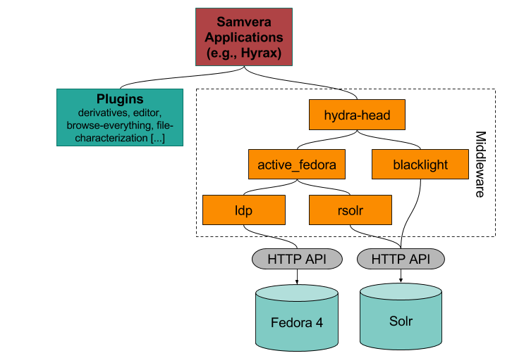

# CU Scholar

CU Scholar is the University of Colorado Libraries Institutional Repository. This repository serves as a platform for preserving and providing public access to the research activities of members of the CU Boulder community.  The repository is using [Samvera](https://samvera.org/samvera-open-source-repository-framework) an open source repository framework. 

## Samvera Technical Stack

## Infrastructure

CU Scholar utilizes the CU Library [infrastructure](/pages/infrastructure). 

## CU Scholar Components

1. Hyrax  [https://github.com/CUB-Libraries-CTA/ir-scholar](https://github.com/CUB-Libraries-CTA/ir-scholar)
2. Ruby gems [https://github.com/CUB-Libraries-CTA/ir-scholar/blob/master/Gemfile](https://github.com/CUB-Libraries-CTA/ir-scholar/blob/master/Gemfile)
3. Fedora 4.7 [https://duraspace.org/fedora/](https://duraspace.org/fedora/)
    * Fedora [features](https://duraspace.org/fedora/resources/publications/fedora-digital-preservation/)
    * Metadata stored within Mysql Relational Database - [AWS RDS](https://aws.amazon.com/rds/aurora/serverless/)
4. Solr 6.x [https://solr.apache.org/](https://solr.apache.org/)

### Metadata

CU Scholar metadata is stored within the Flexible Extensible Digital Object Repository Architecture(fedora). The metadata utilizes the Mysql AWS RDS database. Fedora logs all changes and stores metadata changes within the database. [Backup Policy](/pages/backup) (CTS 4)

### Data Files

CU Scholar data files are stored within the Flexibile Extensible Digital Object Repository Architecture(fedora). The production data files are stored within AWS S3 object storage service. AWS S3 standard storage is designed to provide 99.999999999% durability and 99.99% availability of objects over the course of a year.

[Backup Policy](/pages/backup) (CTS 3: offsite copy to [CU Boulder PetaLibrary](/pages/globus-petalibrary.md).

### Data File Checks

1. All files uploaded undergoes virus scan.(CTS 4)
2. Fixity checksums are performed at a regular interval (Quarterly). (CTS 3)
