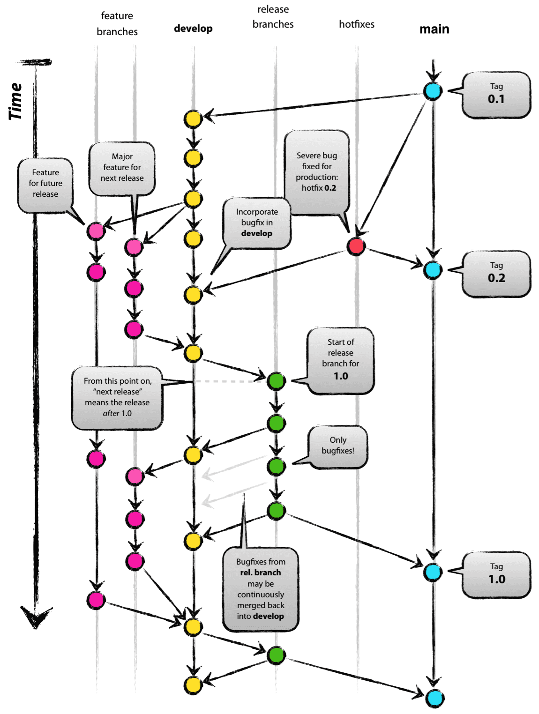

# Version Control

CU Libraries uses git as its version control system. All repositories are stored remotely within [Github](https://github.com/culibraries)

## Branch Management

Git Flow model for branch management.

### Main Branches

1. main
2. develop

### Supporting Branches

1. Feature branches
2. Release branches
3. Hot-fix branches

### Pull Request with Code Review 

A pull request(PRs) is required to merge code into the `main` branch. All PRs to the `main` branch require a code review.